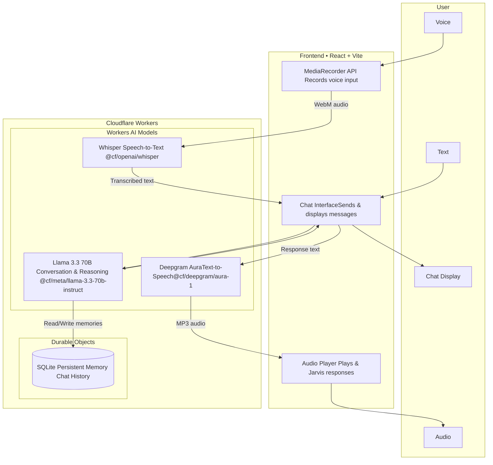

# Jarvis - Voice-Enabled AI Assistant

A personal AI assistant built entirely on Cloudflare's platform, featuring voice input/output, persistent memory, and a conversational personality inspired by Iron Man's Jarvis.
[Link to the App](https://cf-ai-jarvis.duvvurisuryateja95.workers.dev/)


## Features

- **Voice Input** - Speak to Jarvis using your microphone (Whisper STT)
- **Voice Output** - Jarvis responds with natural speech (Deepgram Aura TTS)
- **Persistent Memory** - Remembers facts about you across conversations (SQLite in Durable Objects)
- **Natural Conversation** - Powered by Llama 3.3 70B with a warm, butler-like personality
- **Modern UI** - Clean React interface with Jarvis-blue theming

## Tech Stack

| Component | Technology |
|-----------|------------|
| **LLM** | Llama 3.3 70B (`@cf/meta/llama-3.3-70b-instruct-fp8-fast`) |
| **Speech-to-Text** | Whisper (`@cf/openai/whisper`) |
| **Text-to-Speech** | Deepgram Aura (`@cf/deepgram/aura-1`) |
| **State/Memory** | Durable Objects with SQLite |
| **Backend** | Cloudflare Workers + Agents SDK |
| **Frontend** | React 19 + Vite |
| **Styling** | Tailwind CSS |

**100% Cloudflare Stack** - No external API dependencies.

## Architecture


### How It Works

1. **You speak** → Microphone records audio → Whisper converts to text
2. **You type** → Text goes directly to chat
3. **Jarvis thinks** → Llama 3.3 processes your message, checks memories
4. **Jarvis remembers** → Important facts saved to SQLite
5. **Jarvis responds** → Text appears in chat
6. **Jarvis speaks** → Deepgram Aura converts response to audio

## Getting Started

### Prerequisites

- Node.js 18+
- A Cloudflare account
- Wrangler CLI (`npm install -g wrangler`)

### Installation

1. **Clone the repository**
   ```bash
   git clone <your-repo-url>
   cd cf_ai_jarvis
   ```

2. **Install dependencies**
   ```bash
   npm install
   ```

3. **Login to Cloudflare**
   ```bash
   wrangler login
   ```

4. **Run locally**
   ```bash
   npm start
   ```

5. **Open in browser**
   ```
   http://localhost:5174
   ```

### Deployment

Deploy to Cloudflare Workers:

```bash
npm run deploy
```

Your Jarvis assistant will be live at your Workers URL.

## Usage

### Text Chat
Simply type in the chat box and press Enter or click the send button.

### Voice Input
1. Click the microphone button
2. Speak your message
3. Stop speaking for 2 seconds - it will auto-send
4. Or click the mic again to stop manually

### Memory
Jarvis automatically remembers things you tell him:
- "My name is John" → Jarvis remembers your name
- "I work at Google" → Jarvis remembers your job
- "I prefer morning meetings" → Jarvis remembers your preferences

Clear the chat and start a new conversation Jarvis will still remember!


## Project Structure

```
cf_ai_jarvis/
├── src/
│   ├── server.ts      # Backend: Agent, memory, API endpoints
│   ├── app.tsx        # Frontend: React UI
│   ├── tools.ts       # Tool definitions (optional)
│   └── utils.ts       # Utility functions
├── wrangler.jsonc     # Cloudflare configuration
├── package.json
└── README.md
```

## Key Implementation Details

### Memory System

Jarvis uses SQLite (via Durable Objects) to persist memories:

```typescript
// Save a memory
await this.saveMemory("name", "John");

// Retrieve all memories
const memories = await this.getMemories();
```

Memories are automatically extracted from Jarvis's responses using the pattern `[MEMORY: key=value]` and stored in the database.

### Voice Pipeline

1. **Input**: Browser MediaRecorder → WebM audio → `/transcribe` → Whisper → Text
2. **Processing**: Text → Llama 3.3 70B → Response text
3. **Output**: Response text → `/speak` → Deepgram Aura → Audio playback

### Silence Detection

Voice input automatically stops after 2 seconds of silence using Web Audio API:

```typescript
const analyser = audioContext.createAnalyser();
// Monitor audio levels, stop when silent
```

## Configuration

Edit `wrangler.jsonc` to customize:

```jsonc
{
  "name": "cf-ai-jarvis",
  "ai": {
    "binding": "AI"
  },
  "durable_objects": {
    "bindings": [
      {
        "name": "Chat",
        "class_name": "Chat"
      }
    ]
  }
}
```

## Prompt Engineering

See [PROMPTS.md](./PROMPTS.md) for detailed documentation of the system prompts used in this project.

## Limitations

- Voice output requires user interaction first (browser autoplay policy)
- Memory is per-user session (based on Durable Object ID)
- Whisper may have slight latency for longer audio clips

## Future Improvements

- [ ] Add tool calling for tasks/reminders
- [ ] Implement wake word detection ("Hey Jarvis")
- [ ] Add conversation history export
- [ ] Multi-language support
- [ ] Custom voice selection

## License

MIT

## Acknowledgments

- Built with [Cloudflare Workers AI](https://developers.cloudflare.com/workers-ai/)
- Agents SDK by [Cloudflare](https://github.com/cloudflare/agents)
- Inspired by J.A.R.V.I.S. from Iron Man
